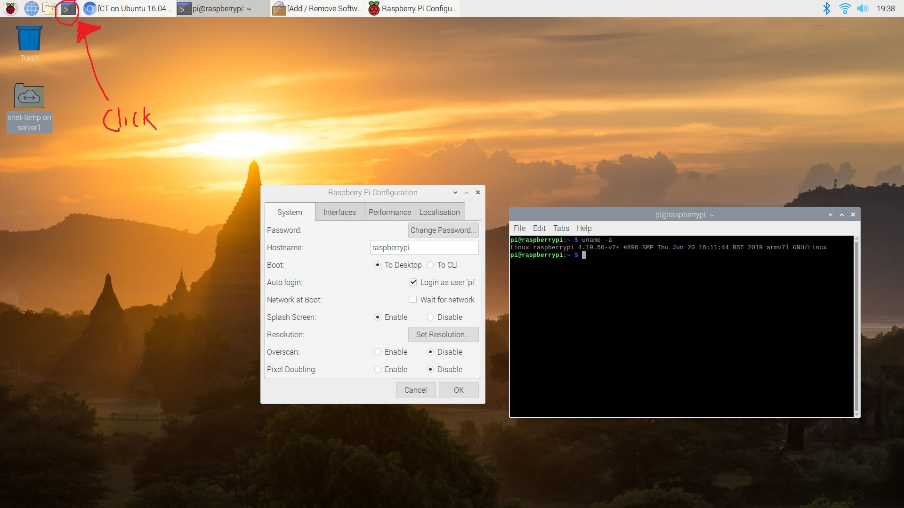
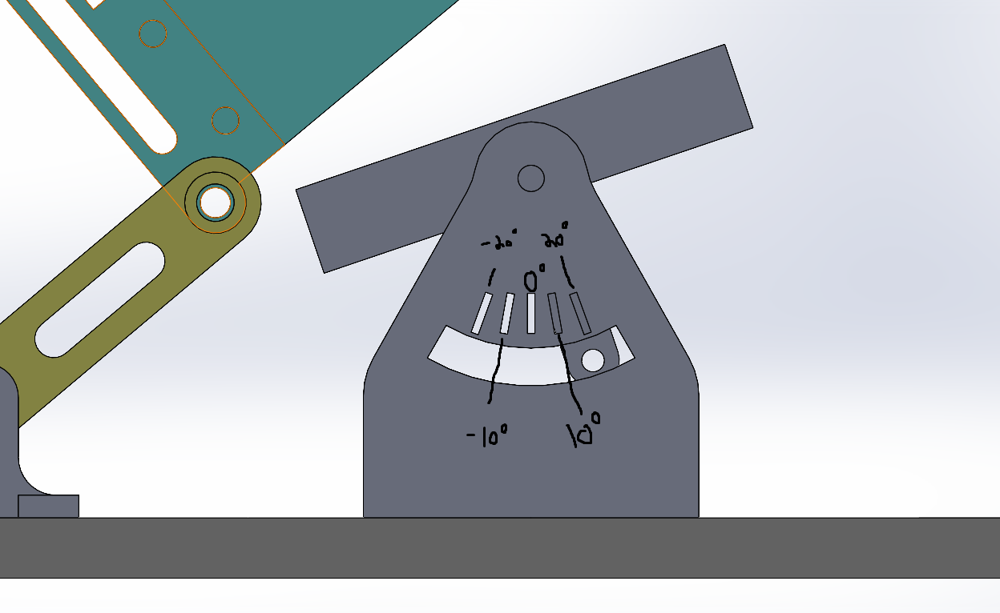
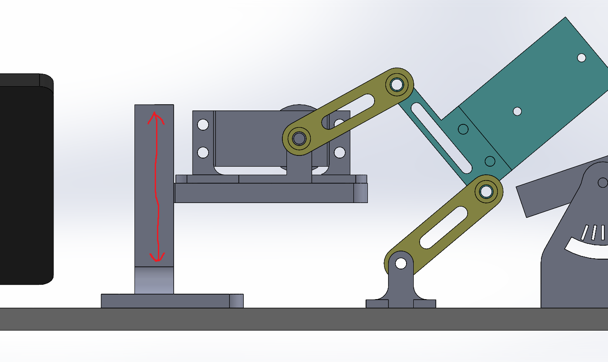

# Peck-o-nator

## Getting Started 

1. Power on the device by pressing the on button on the power supply. Wait for the device to boot to the home screen
2. Click on the terminal icon indicated in Figure 1. 

</img>
Figure 1.

3. This will open an on screen keyboard and the graphical user interface (GUI) for the peck-o-nator. 
4. Input the experiment properties
5. Press the "Confirm Properties" button and press run to run the experiment 
5.1. Alterntatively press "Default Peck" for a standard peck that can be used to align the experiment
6. Data is saved into the Peck-o-nator file called Data-#.txt where # represents the trial ran. 

Misc.
The cutouts for angling the sample are in 10 degree increments as shown in Figure 2. 
</img>
Figre 2.
The angle of the peck can be adjusted by using the screw to raise or lower the servo platform as shown Figure 3.
</img>
